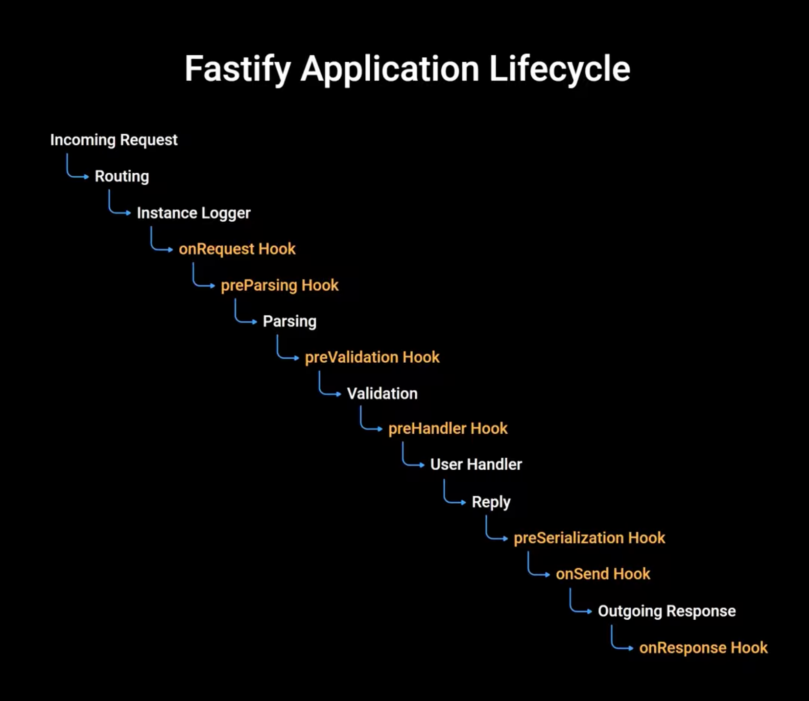
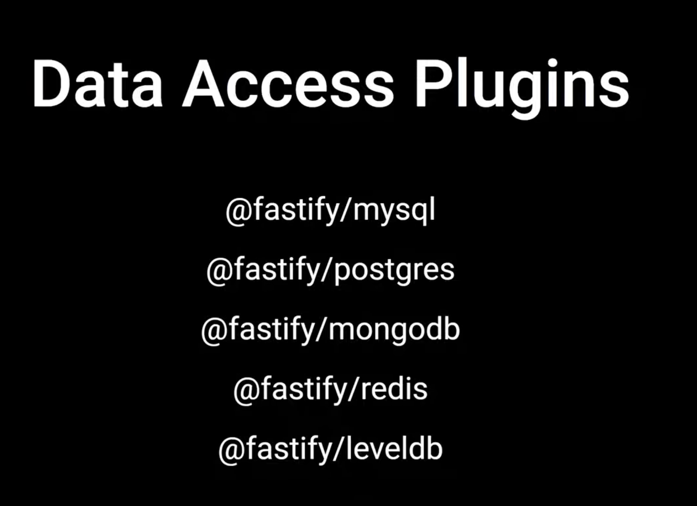

# Fastify Learning Project - Learning Notes

This project demonstrates core Fastify concepts through a practical greeting API. Below are detailed notes on what I learned and how each concept was applied.

---

## 📚 Table of Contents

1. [Fastify Instance Creation](#1-fastify-instance-creation)
2. [Plugin Architecture](#2-plugin-architecture)
3. [Request Decorators (`decorateRequest`)](#3-request-decorators-decoraterequest)
4. [Lifecycle Hooks (`addHook`)](#4-lifecycle-hooks-addhook)
5. [Schema System: Validation & Serialization](#5-schema-system-validation--serialization)
6. [Route Definitions](#6-route-definitions)
7. [Route Prefix & Encapsulation](#7-route-prefix--encapsulation)
8. [Visual References](#8-visual-references)

---

## 1. Fastify Instance Creation

**File:** `src/index.js` (lines 9-11)

```javascript
const fastify = Fastify({
  logger: true, // Enables built-in Pino logging for request/response lifecycles
});
```

### What I Learned
- Fastify's constructor accepts configuration options that apply globally
- `logger: true` enables **Pino** - a fast, structured JSON logger built-in to Fastify
- The logger automatically logs request/response lifecycles with timing information

### How I Used It
Created the root Fastify instance with logging enabled to observe all incoming requests and responses during development.

---

## 2. Plugin Architecture

**File:** `src/index.js` (lines 13-25), `src/greetings-controllser.js` (lines 1-180)

```javascript
// In index.js - Registering the plugin with a prefix
fastify.register(greetingController, { prefix: "/greetings" });

// In greetings-controllser.js - Plugin signature
const greetingController = (fastify, options, done) => {
  // ... plugin logic
  done(); // Signal completion for sync plugins
};
export default greetingController;
```

### What I Learned
- **Plugins** are the fundamental building blocks in Fastify for encapsulation
- Plugin signature: `(fastify, options, done) => void` or `async (fastify, options) => void`
- `fastify` - An encapsulated **child Fastify instance** isolated to this plugin scope
- `options` - Configuration object passed during registration
- `done` - Lifecycle callback for synchronous plugin setup (not needed for async plugins)

### Key Concepts Demonstrated
| Concept | Description |
|---------|-------------|
| **Route Encapsulation** | All routes inside the plugin automatically get the `/greetings` prefix |
| **Scope Isolation** | Decorators/hooks added in the plugin don't leak to parent |
| **Inheritance** | Child plugins inherit parent decorators and hooks |

### How I Used It
Created `greetingController` as a plugin that encapsulates all greeting-related routes, decorators, and hooks under the `/greetings` prefix.

---

## 3. Request Decorators (`decorateRequest`)

**File:** `src/greetings-controllser.js` (lines 38-56)

```javascript
/**
 * V8 Optimization Note:
 * Decorating requests up-front initializes consistent hidden classes in V8.
 * This ensures high execution performance compared to dynamically attaching
 * arbitrary properties inside lifecycle hooks or route handlers.
 */

// Primary request decorator for timestamp tracking
fastify.decorateRequest("loggedTime", "");

// Secondary request decorator with default fallback location
fastify.decorateRequest("currentLocation", "Vaasa, Ostrobothnia, Finland");
```

### What I Learned
- **`decorateRequest(name, defaultValue)`** extends Fastify's core `Request` prototype
- Properties are defined **up-front** (not dynamically) for V8 hidden class optimization
- Decorators are **scoped to the plugin** and its children
- Each custom property must be declared explicitly

### Performance Note
> Declaring decorators up-front initializes consistent hidden classes in V8, ensuring high execution performance compared to dynamically attaching arbitrary properties (e.g., `request.myNewProp = value`) inside lifecycle hooks or route handlers.

### How I Used It
Defined two request properties:
1. `loggedTime` - Populated by the `onRequest` hook with the current timestamp
2. `currentLocation` - Default location, overridden in the hook

Accessed in route handlers via `request.loggedTime` and `request.currentLocation`.

---

## 4. Lifecycle Hooks (`addHook`)

**File:** `src/greetings-controllser.js` (lines 58-73)

```javascript
/**
 * `onRequest` is the very first hook fired when an HTTP request enters the server,
 * executing prior to parsing parameters, query strings, body payload, or route matching.
 */
fastify.addHook("onRequest", async (request, reply) => {
  // Populate/mutate the pre-decorated request instance properties for downstream routes
  request.loggedTime = new Date().toISOString();
  request.currentLocation = "Vaasa, Ostrobothnia, Finland";
});
```

### What I Learned
- **Hooks** intercept Fastify's internal execution lifecycle
- **`onRequest`** - First hook, runs before parsing params/query/body or route matching
- **Async handlers** implicitly return a Promise - **don't call `done()`** when using async/await
- Fastify resolves completion automatically when the async function completes

### Hook Execution Order (Key Ones)
```
onRequest → preParsing → preValidation → preHandler → handler → preSerialization → onSend → onResponse → onError → onClose
```

### How I Used It
Used `onRequest` to populate the request decorators (`loggedTime` and `currentLocation`) before any route handler executes, ensuring every request has these values available.

---

## 5. Schema System: Validation & Serialization

**File:** `src/greetings-controllser.js` (lines 14-36, 126-160)

### Response Schema (Strict Output Filtering)

```javascript
const responseSchema = {
  response: {
    200: {
      type: "object",
      properties: {
        message: { type: "string" },
        loggedTime: { type: "string" }, // Must be defined here, or fast-json-stringify will strip it
      },
      required: ["message", "loggedTime"],
    },
  },
};
```

### Full Route Schema (Input + Output)

```javascript
schema: {
  params: {
    type: "object",
    properties: {
      username: { type: "string" },
    },
    required: ["username"],
  },
  querystring: {
    type: "object",
    properties: {
      lastName: { type: "string" },
    },
    required: ["lastName"],
  },
  response: {
    200: { /* ... */ },
    500: { /* error response schema */ }
  },
}
```

### What I Learned
Fastify uses **compiled JSON schemas** for high performance:

| Component | Purpose |
|-----------|---------|
| **Ajv** | Validates incoming request payloads (params, query, body, headers) |
| **fast-json-stringify** | Serializes outgoing responses up to **2x faster** than `JSON.stringify()` |

### ⚠️ CRITICAL SECURITY & SERIALIZATION RULE
> **Response schemas act as strict output filters.** Any property returned by a route handler that is **NOT explicitly declared** in `response[statusCode].properties` will be **automatically stripped** from the outgoing JSON response to prevent accidental data leaks.

### How I Used It
- Defined response schemas for all routes to enable fast-json-stringify serialization
- Added input validation for params and querystring on the `/full/:username` route
- Ensured all returned properties (`message`, `loggedTime`) are declared in the schema's `required` array

---

## 6. Route Definitions

### 6.1 Shorthand Method (`fastify.get`)

**File:** `src/greetings-controllser.js` (lines 76-87)

```javascript
fastify.get("/", { schema: responseSchema }, async (request, reply) => {
  return {
    message: `Hello, world! from ${request.currentLocation}`,
    loggedTime: request.loggedTime,
  };
});
```

- **Registers GET route** at `/` relative to plugin prefix → `GET /greetings/`
- Schema passed as second argument
- **Async handler** - direct return preferred over `reply.send()`

### 6.2 Dynamic Path Parameters

**File:** `src/greetings-controllser.js` (lines 90-108)

```javascript
fastify.get("/:username", { schema: responseSchema }, async (request, reply) => {
  const { username } = request.params; // Auto-parsed by Fastify
  const { loggedTime, currentLocation } = request; // Access decorators

  return {
    message: `Hello, ${username}! from ${currentLocation}`,
    loggedTime: loggedTime,
  };
});
```

- Path parameters available at `request.params`
- Request decorators accessible directly on `request` object

### 6.3 Full Route Declaration (`fastify.route()`)

**File:** `src/greetings-controllser.js` (lines 111-173)

```javascript
fastify.route({
  method: "GET",
  url: "/full/:username",
  schema: { /* complete input/output contract */ },
  handler: async (request, reply) => {
    const { username } = request.params;
    const { lastName } = request.query; // Query string params
    const { loggedTime, currentLocation } = request;
    
    return {
      message: `Hello, ${username} ${lastName}! from ${currentLocation}`,
      loggedTime: loggedTime,
    };
  },
});
```

### What I Learned
- **Shorthand methods** (`get`, `post`, `put`, `delete`) are syntactic sugar over `fastify.route()`
- **`fastify.route()`** provides complete control over:
  - Multi-part schema contracts (params, querystring, body, headers, response)
  - Route-level hooks (`preHandler`, `onRequest`)
  - Custom constraints
  - Metadata config

### How I Used It
Demonstrated all three approaches:
1. Simple GET with shorthand
2. Dynamic params with shorthand
3. Full declaration with complete schema validation (params + querystring + response for 200/500)

---

## 7. Route Prefix & Encapsulation

**File:** `src/index.js` (line 25)

```javascript
fastify.register(greetingController, { prefix: "/greetings" });
```

### What I Learned
- **Prefix option** automatically prepends to all routes in the plugin
- Routes in plugin:
  - `/` → `/greetings/`
  - `/:username` → `/greetings/:username`
  - `/full/:username` → `/greetings/full/:username`
- **Encapsulation** creates a child context - changes don't affect parent

### How I Used It
Registered the greeting plugin with `/greetings` prefix, so all greeting routes are organized under this namespace.

---

## 8. Visual References

### Application Life Cycle


This diagram illustrates Fastify's request/response lifecycle, showing the order of hooks from `onRequest` through `onResponse` and `onClose`. Understanding this flow is crucial for placing logic at the right lifecycle stage.

### Data Access & Plugins


This diagram shows how plugins encapsulate data access patterns, demonstrating the relationship between parent and child contexts, decorator inheritance, and scope isolation.

---

## 🎯 Summary of Key Takeaways

| Concept | Key Insight |
|---------|-------------|
| **Plugin Architecture** | Encapsulation via child contexts; prefix for route organization |
| **Decorators** | Define up-front for V8 optimization; scoped to plugin |
| **Hooks** | `onRequest` runs first; async = no `done()` needed |
| **Schema** | Response schemas = strict output filters (security!) |
| **Serialization** | fast-json-stringify ≈ 2x faster than JSON.stringify |
| **Routes** | Shorthand for simple cases; `route()` for full control |

---

## 🚀 Running the Project

```bash
# Install dependencies
pnpm install

# Start server
pnpm start       # Runs on port 3000
pnpm dev         # Auto-reload with nodemon
```

### Test Endpoints
```bash
# Base greeting
curl http://localhost:3000/greetings/

# With username param
curl http://localhost:3000/greetings/John

# Full route with query string
curl "http://localhost:3000/greetings/full/John?lastName=Doe"
```

---

*Generated from project code comments and Fastify documentation concepts*